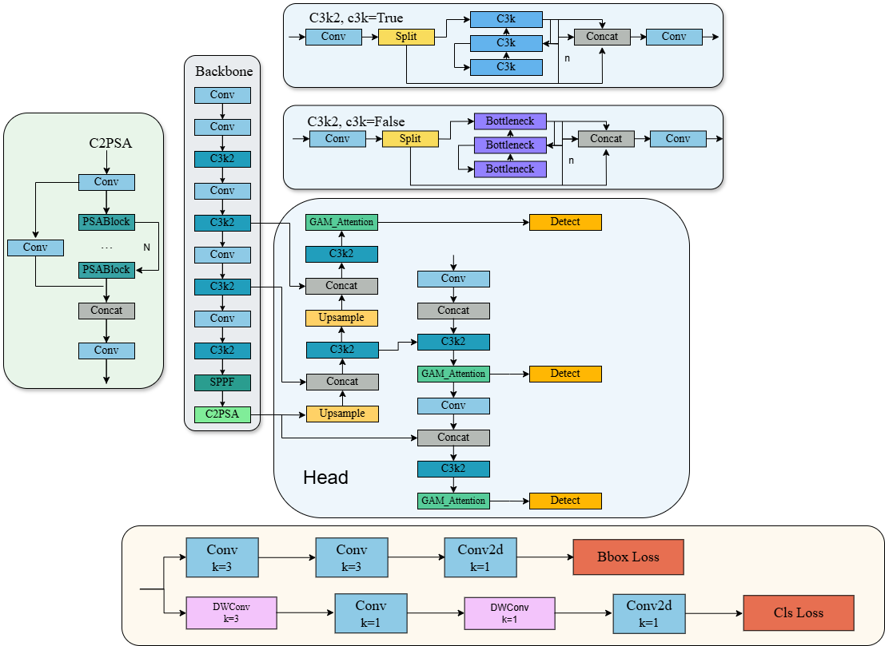

# 基于YOLOv11m_GAM_Attention的肺结节检测系统

## 项目结构

```
lung-nodule-detection/
│
├── app.py                 # Flask应用程序主入口
├── detect.py              # YOLO检测模块
├── best.pt                # 预训练的YOLO权重文件(通过对ultralytics-main中的YOLOv11进行训练得到的最佳权重)
├── requirements.txt       # 项目依赖
│
├── static/                # 静态文件目录
│   ├── uploads/           # 上传的图像存储目录
│   ├── results/           # 检测结果图像和CSV文件存储目录
│   ├── images/            # 系统界面图片目录
│   │   └── yolov11.jpg    # 系统背景图片
│   └── fonts/             # 字体文件目录
│       └── simhei.ttf     # 中文字体
│
└── templates/             # HTML模板
    ├── index.html         # 主页模板
    └── exit.html          # 退出页面模板
```

## 功能特点

1. 支持上传肺部CT图像（PNG、JPG、JPEG格式）
2. 使用YOLOv11检测肺结节
3. 实时显示检测结果，包括：
   - 标记了目标框、类别、置信度的图像
   - 检测时间统计
   - 检测到的目标数量
   - 每个目标的位置坐标（xmin, ymin, xmax, ymax）
   - 每个目标的类别和置信度
4. 以表格形式展示详细的检测结果
5. 提供保存功能，可将检测结果导出为CSV文件

## 安装与运行

1. 克隆或下载本项目代码
   ```
   git clone https://github.com/mapleovo1/YOLOv11-GAM-Attention-Lung-Nodule-Detection-Web.git
   ```
2. 安装所需依赖：
   ```
   pip install -r requirements.txt
   ```

3. 准备必要文件：

| Model                       | size (pixels) |  mAP<sup>val</sup><sub>50</sub> | mAP<sup>val</sup><sub>50–95</sub> | Layers | params (M) | FLOPs (B)  |
|-----------------------------|---------------|---|-----------------------------------|--------|---|---|
| [YOLOv11m_GAM_Attention](https://github.com/mapleovo1/YOLOv11-GAM-Attention-Lung-Nodule-Detection-Web/releases/download/v1.0/YOLOv11m_GAM_Attention.pt) | 640           | 0.888  | 0.587                             |   149    | 23.9 |  80.2 |
| [YOLO11m](https://github.com/mapleovo1/YOLOv11-GAM-Attention-Lung-Nodule-Detection-Web/releases/download/v1.0/YOLOv11m.pt)                | 640           |  0.859 | 0.579                             |   125    | 20.0 |  67.6 |

   - 将`app.py`的 `best.pt` 替换成下载的GAMA_YOLO11m模型权重文件并放在项目根目录
   - 将中文字体文件 `simhei.ttf` 放在 `static/fonts/` 目录下

4. 创建必要的目录：
   ```
   mkdir -p static/uploads static/results static/fonts
   ```

5. 运行应用程序：
   ```
   python app.py
   ```

6. 在浏览器中访问：
   ```
   http://localhost:5000
   ```

## 使用说明

1. 在主页点击"选择文件"上传肺部CT图像
2. 系统会自动处理图像并显示检测结果
3. 您可以在右侧面板查看详细的检测信息
4. 使用"目标选择"下拉框可以切换查看不同的检测目标
5. 检测结果表格会显示在页面底部
6. 点击"保存"按钮可以将检测结果导出为CSV文件
7. 点击"退出"按钮可以安全退出系统

## YOLOv11m_GAM_Attention模型

下图是加入全局注意力机制(Global Attention Mechanism, GAM)的YOLOv11模型结构: 



GAM由通道注意力子模块和空间注意力子模块组成，按顺序处理输入特征图。
   - 通道注意力子模块：使用3D排列和两层MLP（多层感知机）来捕捉跨维度的通道-空间依赖关系。
   - 空间注意力子模块：通过卷积层融合空间信息，避免使用最大池化以减少信息损失，并采用分组卷积和通道混洗（channel shuffle）来控制参数增长。

本项目基于 Ultralytics YOLOv11 系列，在检测头中每一分支（P3、P4、P5）特征图上分别加入 GAM_Attention 模块，用于肺结节单类别目标检测任务，有效提升模型对目标区域的关注。
